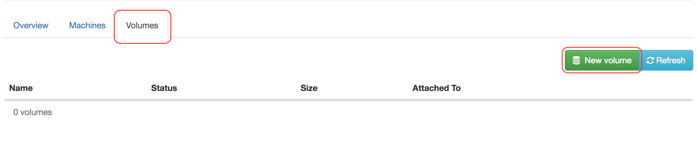
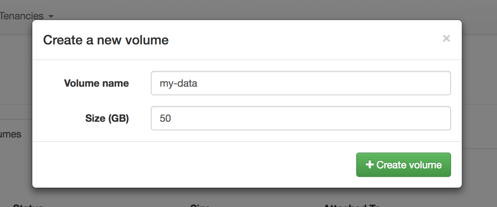

##  Managing storage

When provisioned, a virtual machine gets allocated a small hard disk (the
exact size of the disk depends on the selected machine size). This disk is
intended to run the operating system only. If you require additional storage
for data, it is possible to add extra volumes to a virtual machine.

First, create a new volume by navigating to the volumes tab and clicking on
"New Volume":

This will launch a dialog that allows you to specify a name and size for the
volume:

Once the volume becomes available, you can attach it to a VM. First, click on
the "Actions" button and select "Attach volume to machine":

This will open a dialog allowing you to select the VM that you want to attach
the volume to:

Once the volume has attached to the VM, the new disk will be visible to the
machine but will not be usable. This can be verified using the `lsblk`
command:

    
    
    $ lsblk
    NAME   MAJ:MIN RM SIZE RO TYPE MOUNTPOINT
    sda      8:0    0   4G  0 disk 
    └─sda1   8:1    0   4G  0 part /
    sdb      8:16   0  50G  0 disk
    

Here, we can see that the operating system is recognising the new disk - `sdb`
\- but there are no partitions or file systems associated with it. To make the
disk usable, it must be formatted with a filesystem and mounted somewhere,
e.g. `/data`:

    
    
    # Create a single partition spanning the whole disk
    $ fdisk /dev/sdb
    Device contains neither a valid DOS partition table, nor Sun, SGI or OSF disklabel
    Building a new DOS disklabel with disk identifier 0x598d636f.
    Changes will remain in memory only, until you decide to write them.
    After that, of course, the previous content won't be recoverable.
    
    Warning: invalid flag 0x0000 of partition table 4 will be corrected by w(rite)
    
    Command (m for help): n
    Partition type:
       p   primary (0 primary, 0 extended, 4 free)
       e   extended
    Select (default p):
    Using default response p
    Partition number (1-4, default 1):
    Using default value 1
    First sector (2048-33554431, default 2048):
    Using default value 2048
    Last sector, +sectors or +size{K,M,G} (2048-33554431, default 33554431):
    Using default value 33554431
    
    Command (m for help): w
    The partition table has been altered!
    
    Calling ioctl() to re-read partition table.
    Syncing disks.
    
    # Verify that the partition was created
    $ lsblk /dev/sdb
    NAME   MAJ:MIN RM SIZE RO TYPE MOUNTPOINT
    sdb      8:16   0  16G  0 disk
    └─sdb1   8:17   0  16G  0 part
    
    # Create a filesystem on the partition
    $ mkfs.ext4 /dev/sdb1
    mke2fs 1.42.9 (4-Feb-2014)
    Filesystem label=
    OS type: Linux
    Block size=4096 (log=2)
    Fragment size=4096 (log=2)
    Stride=0 blocks, Stripe width=0 blocks
    1048576 inodes, 4194048 blocks
    209702 blocks (5.00%) reserved for the super user
    First data block=0
    Maximum filesystem blocks=4294967296
    128 block groups
    32768 blocks per group, 32768 fragments per group
    8192 inodes per group
    Superblock backups stored on blocks:
        32768, 98304, 163840, 229376, 294912, 819200, 884736, 1605632, 2654208,
        4096000
    
    Allocating group tables: done
    Writing inode tables: done
    Creating journal (32768 blocks): done
    Writing superblocks and filesystem accounting information: done
    
    # Mount the filesystem
    $ mkdir /data
    $ mount /dev/sdb1 /data
    
    # Verify that the filesystem is now available
    $ lsblk
    NAME   MAJ:MIN RM SIZE RO TYPE MOUNTPOINT
    sda      8:0    0   4G  0 disk 
    └─sda1   8:1    0   4G  0 part /
    sdb      8:16   0  50G  0 disk 
    └─sdb1   8:17   0  50G  0 part /data
    $ df -h
    Filesystem      Size  Used Avail Use% Mounted on
    /dev/sda1       4.0G  1.4G  2.7G  34% /
    devtmpfs        222M     0  222M   0% /dev
    tmpfs           245M     0  245M   0% /dev/shm
    tmpfs           245M  8.8M  236M   4% /run
    tmpfs           245M     0  245M   0% /sys/fs/cgroup
    tmpfs            49M     0   49M   0% /run/user/0
    /dev/sdb1        50G   53M   47G   1% /data
    
    # Add a line to /etc/fstab to make the mount persistent (i.e. automatic mount on boot)
    echo "/dev/sdb1  /data  ext4  defaults  0 0" >> /etc/fstab
    

