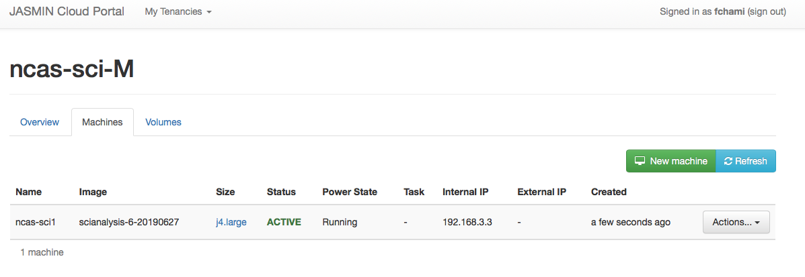
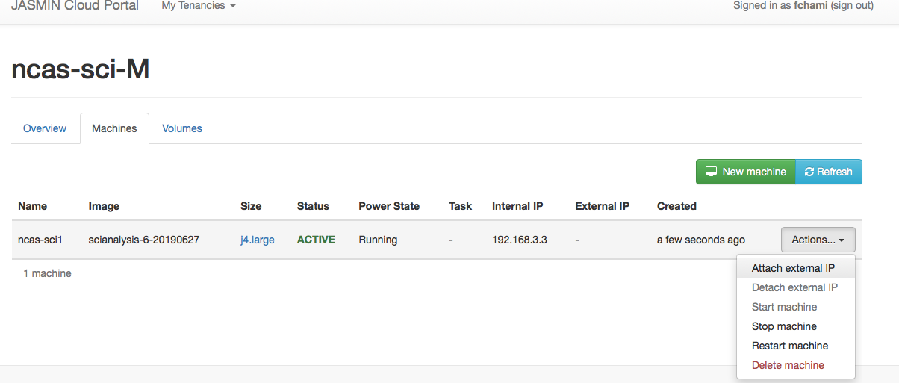

This article is for admin and manager of the JASMIN managed-cloud Sci tenancy.
It illustrates how to provision a sci VM within a JASMIN managed-cloud Sci
tenancy. It involves the following:

  * Becoming a member of a managed cloud Sci tenancy
  * Provisioning a VM 

The Sci tenancy has four access roles:

  * Manager role: can approve Deputy, ADMIN, and USER roles access requests
  * Deputy manager role: can approve ADMIN and USER roles access requests
  * ADMIN role: can access the cloud portal and can restart or provision the Sci VM
  * USER role: can log in into the Sci VM from the JASMIN login node login1.jasmin.ac.uk

**Note:** Manager, Deputy Manager, and ADMIN have access to the JASMIN cloud
portal

## Apply for access to the Sci tenancy

A managed cloud Sci tenancy is accessible via the [JASMIN cloud
portal](https://cloud.jasmin.ac.uk/) and this access is controlled by the "Sci
Analysis VMs" service via the[ JASMIN accounts
portal](https://accounts.jasmin.ac.uk). See  MISSING LINK for instructions about requesting access to the USER and
ADMIN roles via the Sci Analysis VMs service on the JASMIN accounts portal.

## 1\. Access the tenancy

With an ADMIN role, you can log in to the [JASMIN cloud
portal](https://cloud.jasmin.ac.uk/) using the same credentials for signing
onto the JASMIN accounts portal.

You will be presented with the "Dashboard" page -below- showing the tenancies
you have access to. On the dashboard, select the organization representing the
tenancy to find out the VM provisioned within a given tenancy, e.g ncas-sci-M

Note: The "  ncas-sci-M" shown below has 0 machines as this is a new tenancy.
We will proceed next to the provisioning of a virtual machine.

## 2\. Provision a virtual machine

**Step 1:** Select "Machines" from the top menu, then click "New machine" to
create a new VM. Choose a name for the new VM. Then select a size from the
drop-down menu which shows the catalog of VM template size. For example,
select "j4.large" which allocates 8 CPUs and 32GB of RAM resources for the new
VM

**IMPORTANT:** A Sci machine should be deployed with **a minimum of 2 GB RAM**

**IMPORTANT** : A Sci machine name should not exceed 8 characters long. The
preferred naming format is sci<number> e.g. sci1

The VM with the chosen name ncas-sci1 is created and it is running as shown
below.

**Step 2:** Attach an external IP to the new VM by clicking "Actions" and
selecting "Attach external IP". Note that you can restart the VM from the
"Actions" menu.

**Step 3:** From the box that pops up -see image below- click on the "+"
(green button) to add an IP. Then click on the down arrow next to "Select an
external IP" you will see the IP address to assign to the machine, select the
IP and click attach IP

**Step 4:** Click "Attach IP"

**Important note:** As ADMIN and MANAGER of a Sci tenancy, you should note the
"External IP" as this is the IP address you will need to provide to your users
in order for them to connect to the machine via SSH using the JASMIN login
server login1.jasmin.ac.  uk.

**Step 5:** An overview of the resources used by the VM is shown below

**Note 1:** Only ADMIN and MANAGER roles have access to the JASMIN cloud
portal and can provision VMs. ADMIN and MANAGER roles of a Sci tenancy will
not be granted root access.

**Note 2:** ADMIN and MANAGER roles will not allow you to SSH into the Sci VM.
It is necessary to have a USER role to do so.

## 3\. Connect to Sci analysis VMs

From login1.jasmin.ac.uk, login to the machine using the External IP address.
In the same way, as you login to a JASMIN scientific server via login1. Your
initial connection to JASMIN from your local machine needs to have your SSH
key loaded in your SSH authentication agent, and you must have SSH Agent
Forwarding enabled "-A", see also how  MISSING LINK.

**Note** that although the new provisioned Sci VM has a local hostname (in
this example, sci1-202012041148.ncas-sci-m.jasmin.ac.  uk ), this is NOT
registered in any Domain Name Service (DNS) by default, so you need to connect
to the machine using its External IP address, not the name.

**Note** : Users should report issues to the ADMIN and/or MANAGER of the
tenancy based SCI VM.

